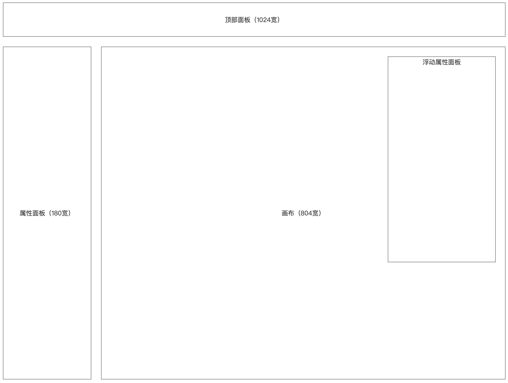
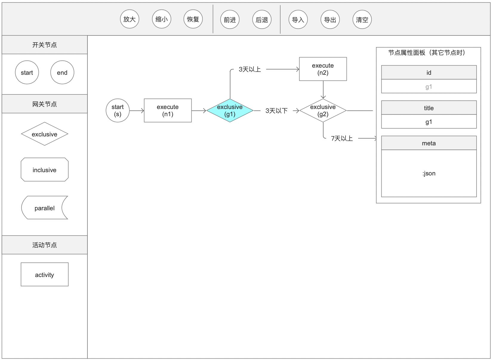
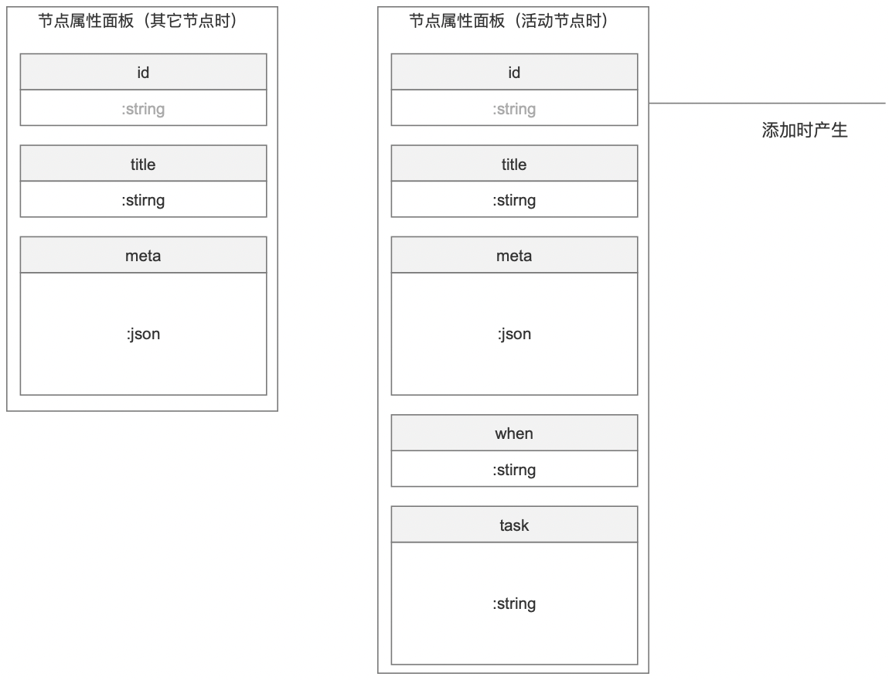
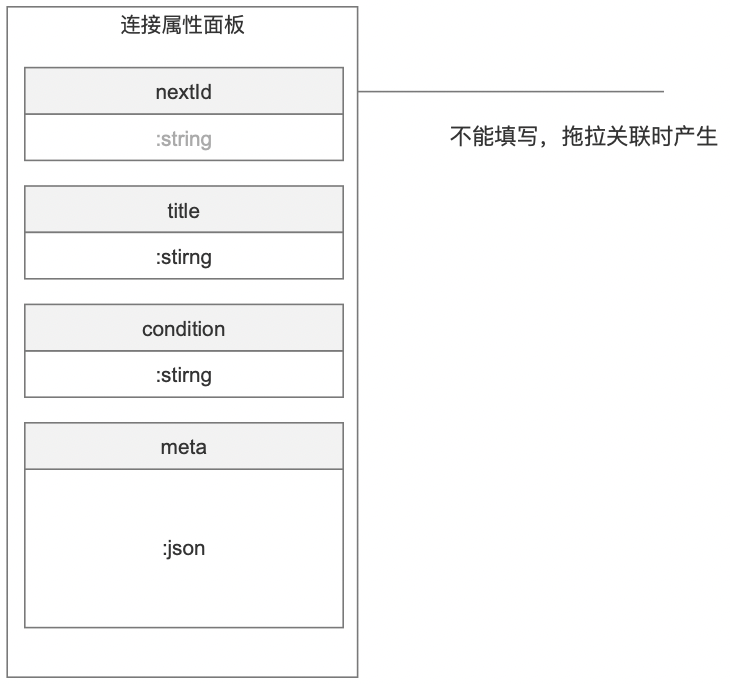
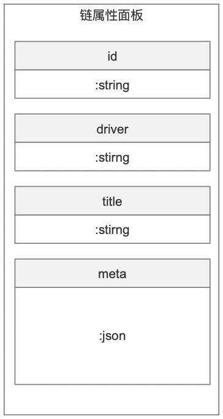

### 描述

编辑器，为单体应用，分为：前端，后端。主要作是：为 solon-flow 的流程配置提供可视界面。通过编译器设计流程图导出配置，或者导入配置还原流程图再次编辑。

前端：设计流程，并产生 json 数据。要求（最好）：样式分离，方便别人提交不同的样式。

后端：协助导入导出。导入时将 yml 格式转为 json 给前端还流程图；导出时 将前端的 json 转为 yml 格式。（如果，前端直接能转；可以去掉后端）。。。如果不需要后端，可以变为单页面应用。

### 预览

框架结构

编辑器主体界面

三个属性面板

 

 
